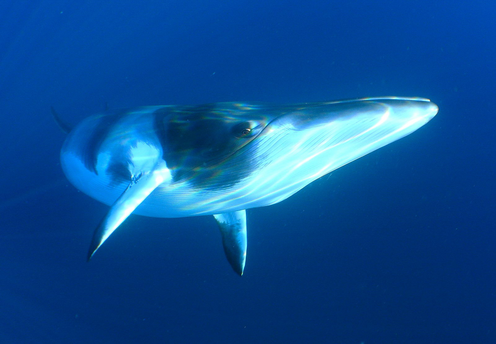

# Minke
**Graph extraction and NLP analysis for Baleen Corpora**

[![Build Status][travis_img]][travis_href]
[![Coverage Status][coveralls_img]][coverals_href]
[![Code Health][health_img]][health_href]
[![Stories in Ready][waffle_img]][waffle_href]

[][minkewhale.jpg]

## About

The [Baleen](https://github.com/bbengfort/baleen) ingestion tool is used to create a corpus of web articles and blogs from RSS feeds. Minke extends Baleen with a library to perform text analysis and perform graph extraction on the exported corpora.

Baleen means &ldquo;whale bone&rdquo; and particularly refers to the straining bones that whales of the mysticeti suborder have. These bones filter food from water as the Baleen ingestion engine filters content from the web. [Minke whales](https://en.wikipedia.org/wiki/Minke_whale) are a specific species of [rorqual whales](https://seaworld.org/Animal-Info/Animal-InfoBooks/Baleen-Whales/Scientific-Classification), one of the shortest in fact. This library is named to indicate it's a short version of the larger Baleen codebase.

### Throughput

### Attribution

The image used in this README, ["Minke whale 1"][minkewhale.jpg] by [Len2040](https://www.flickr.com/photos/lenjoh/) is licensed under [CC BY-ND 2.0](https://creativecommons.org/licenses/by-nd/2.0/)

<!-- References -->
[travis_img]: https://travis-ci.org/bbengfort/minke.svg?branch=master
[travis_href]: https://travis-ci.org/bbengfort/minke/
[coveralls_img]: https://coveralls.io/repos/github/bbengfort/minke/badge.svg?branch=master
[coverals_href]: https://coveralls.io/github/bbengfort/minke?branch=master
[health_img]: https://landscape.io/github/bbengfort/minke/master/landscape.svg?style=flat
[health_href]: https://landscape.io/github/bbengfort/minke/master
[waffle_img]: https://badge.waffle.io/bbengfort/minke.png?label=ready&title=Ready
[waffle_href]: https://waffle.io/bbengfort/minke
[minkewhale.jpg]: https://flic.kr/p/e9s7Z3
